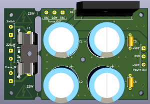
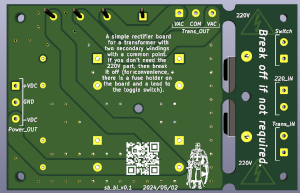
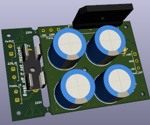

# SB_Bi:  
A simple rectifier board for a transformer with two secondary windings with a  
common point. If you don’t need the 220V part, then break it off (for  
convenience, there is a fuse holder on the board and a lead to the toggle  
switch).  

### Schemes:  
###### sb_bi_v0.1:  
[pdf](docs/sb_bi_v0.1.pdf)  

### Images:  
###### sb_bi_v0.1:  
top:  
  
bottom:  
  
assembly:  
  

###### gerber:  
Archive for production:  
[sb_bi_v0.1](https://github.com/piro-s/SB_Bi/raw/main/gerber/sb_bi_v0.1.zip)  